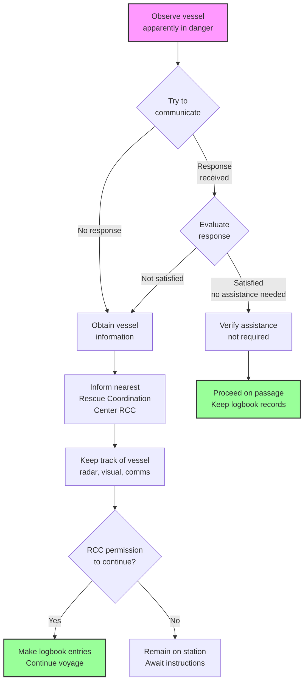
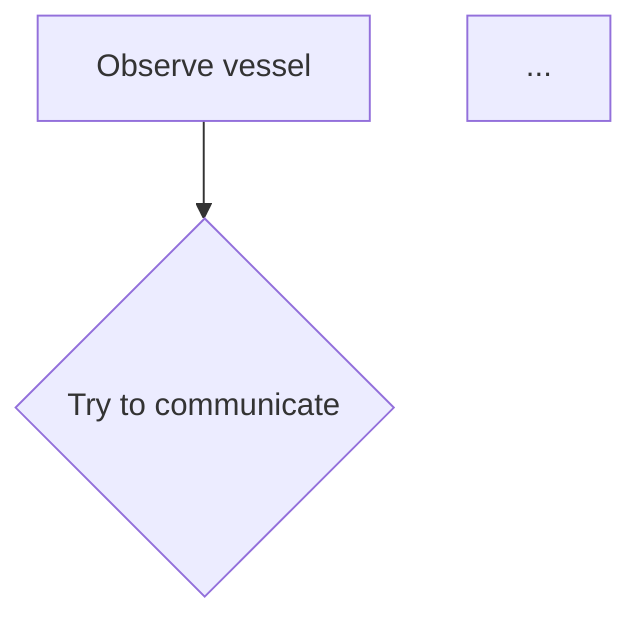

# Document Processing Pipeline - Design Overview

## Executive Summary

This pipeline converts unstructured PDFs into standardized, LLM-friendly formats without any images in the output. Everything is converted to text-based representations: Markdown, YAML, or Mermaid.

---

## 1. Output Format Schema & Example

### Schema Design Principles

- **Modular**: Each entity saved separately for granular access
- **Standardized**: Only 3 formats (Markdown, YAML, Mermaid)
- **Metadata-Rich**: Every entity includes processing context
- **LLM-Optimized**: Clean, structured, easily parseable
- **Compact**: No redundancy, no image blobs

### Complete Output Structure

```
output/
├── entities/                    # Individual entity files
│   ├── E001_text.md            # Text content
│   ├── E002_table.yaml         # Table data
│   ├── E003_diagram.mmd        # Diagram (Mermaid)
│   ├── E004_image_text.md      # Text extracted from image
│   └── E005_table.yaml         # Table extracted from image
├── final_document.md           # All entities assembled in order
└── manifest.yaml               # Processing metadata
```

### Entity File Format Examples

#### Text Entity (`E001_text.md`)
```markdown
---
entity_id: E001
type: text
source_page: 1
position: 1
original_bbox: [72.0, 156.3, 523.2, 789.4]
confidence: 1.0
processing_notes: "Direct text extraction from Docling"
---

## Emergency Reporting Process

Masters are reminded of their legal obligation to report incidents
to Flag, Port and Coast State Authorities, after first advising
the Managers.

### During Office Hours

The Master must report all emergencies by telephone and email to
the Head Office of DANAOS Shipping Co. Ltd (DPA) as soon as possible.

Office normal working hours are Monday to Friday 09:00 to 18:00 hrs.
```

#### Table Entity (`E002_table.yaml`)
```yaml
# Metadata
# entity_id: E002
# type: table
# source_page: 2
# position: 2
# original_bbox: [50.0, 100.0, 550.0, 400.0]
# confidence: 1.0
# processing_notes: "Table extracted from Docling"

fleet_1_vessels:
  - vessel_name: "DIMITRIS C"
    flag: "MAL"
    classification: "DNV"
    mmsi: "229665000"
    callsign: "9HA3500"
    contact:
      master_phone: "+870771306882"
      bridge_phone: "+870771306881"
      satellite_phone: "+870773912280"
      email: "vsl_123@danaos.com"

  - vessel_name: "DIMITRA C"
    flag: "MAL"
    classification: "NK"
    mmsi: "256058000"
    callsign: "9HA3802"
    contact:
      master_phone: "+870771370712"
      bridge_phone: "+870771370713"
      backup_phone: "+870773069604"
      email: "vsl_124@danaos.com"
```

#### Diagram Entity (`E003_diagram.mmd`)


#### Image with Text (`E004_image_text.md`)
```markdown
---
entity_id: E004
type: image_text
source_page: 4
position: 4
original_bbox: [100.0, 200.0, 500.0, 600.0]
confidence: 0.95
processing_notes: "Image classification: Text document/form"
---

### Important Contact Numbers

**Emergency Response Team**
All telephone numbers are listed in Chapter 7

**During Office Hours:**
- DPA/SQE Director
- Operations Director
- Technical Director

**Outside Office Hours:**
Contact any of the above personnel and follow up with email.

**24-Hour Emergency Line:**
+30 210 4191508
```

#### Image with Table (`E005_table.yaml`)
```yaml
# Metadata
# entity_id: E005
# type: table
# source_page: 5
# position: 5
# original_bbox: [75.0, 150.0, 525.0, 700.0]
# confidence: 0.88
# processing_notes: "Image classification: Contact information table"

classification_societies:
  - name: "DNV Piraeus"
    contact_person: "A. Pagalos / S. Lamprinopoulos"
    telephone: "+30 2104100200"
    fax: "+30 210 4220621"
    mobile:
      - "+30 6944 261974"
      - "+30 6945 150050"
    email: "piraeus@dnv.com"

  - name: "Lloyds Athens"
    contact_person: "Deilakis / Anastassovitis"
    telephone: "+30 2104580800"
    fax: "+2112686604"
    mobile:
      - "+30 6955663683"
      - "+30 6946337459"
    email: "piraeus@lr.org"
```

### Final Document (`final_document.md`)

```markdown
---
document_title: "Emergency Procedures Manual Chapter 3"
total_entities: 15
processed_date: "2026-02-05 14:45:32"
source_file: "emergency_procedures_ch3.pdf"
---

# Document: Emergency Procedures Manual Chapter 3

<!-- Entity: E001 | Type: text | Page: 1 -->
## Emergency Reporting Process

Masters are reminded of their legal obligation...

<!-- Entity: E002 | Type: table | Page: 2 -->
```yaml
fleet_1_vessels:
  - vessel_name: "DIMITRIS C"
    flag: "MAL"
    ...
```

<!-- Entity: E003 | Type: diagram | Page: 3 -->


<!-- Entity: E004 | Type: image_text | Page: 4 -->
### Important Contact Numbers

**Emergency Response Team**...

<!-- Entity: E005 | Type: table | Page: 5 -->
```yaml
classification_societies:
  - name: "DNV Piraeus"
    ...
```
```

### Manifest File (`manifest.yaml`)

```yaml
source_document: "emergency_procedures_ch3.pdf"
processed_date: "2026-02-05T14:45:32.123456"
total_entities: 15

entity_type_counts:
  text: 8
  table: 4
  diagram: 2
  image_text: 1

entities:
  - id: E001
    type: text
    page: 1
    position: 1
    confidence: 1.0
    file: "entities/E001_text.md"

  - id: E002
    type: table
    page: 2
    position: 2
    confidence: 1.0
    file: "entities/E002_table.yaml"

  - id: E003
    type: diagram
    page: 3
    position: 3
    confidence: 0.92
    file: "entities/E003_diagram.mmd"

  - id: E004
    type: image_text
    page: 4
    position: 4
    confidence: 0.95
    file: "entities/E004_image_text.md"

  - id: E005
    type: table
    page: 5
    position: 5
    confidence: 0.88
    file: "entities/E005_table.yaml"
```

---

## 2. Integration Architecture

### Pipeline Flow Diagram

```
┌─────────────────────────────────────────────────────────────┐
│                        INPUT PDF                             │
└─────────────────────────────────────────────────────────────┘
                              ↓
┌─────────────────────────────────────────────────────────────┐
│                    DOCLING EXTRACTION                        │
│  • Text blocks with position/bbox                           │
│  • Native PDF tables (high quality)                         │
│  • Images/pictures                                          │
│  • Page structure preservation                              │
└─────────────────────────────────────────────────────────────┘
                              ↓
┌─────────────────────────────────────────────────────────────┐
│                   ENTITY CLASSIFICATION                      │
│                                                             │
│  ┌─────────────┐     ┌──────────────┐                     │
│  │ Text Block  │────▶│ MARKDOWN     │ (direct)            │
│  └─────────────┘     └──────────────┘                     │
│                                                             │
│  ┌─────────────┐     ┌──────────────┐                     │
│  │ PDF Table   │────▶│ YAML         │ (convert MD→YAML)  │
│  └─────────────┘     └──────────────┘                     │
│                                                             │
│  ┌─────────────┐     ┌──────────────┐                     │
│  │   Image     │────▶│ Vision API   │ (classify)          │
│  └─────────────┘     └──────────────┘                     │
│                              │                              │
│                              ├─→ Text? → MARKDOWN          │
│                              ├─→ Table? → YAML             │
│                              ├─→ Diagram? → MERMAID        │
│                              └─→ Mixed? → Best effort       │
└─────────────────────────────────────────────────────────────┘
                              ↓
┌─────────────────────────────────────────────────────────────┐
│                    ENTITY PROCESSING                         │
│  • Add metadata frontmatter                                 │
│  • Format content                                           │
│  • Save individual files                                    │
└─────────────────────────────────────────────────────────────┘
                              ↓
┌─────────────────────────────────────────────────────────────┐
│                   DOCUMENT ASSEMBLY                          │
│  • Combine entities in original order                       │
│  • Add entity markers                                       │
│  • Create manifest                                          │
└─────────────────────────────────────────────────────────────┘
                              ↓
┌─────────────────────────────────────────────────────────────┐
│                         OUTPUT                               │
│  📁 entities/ (individual files)                            │
│  📄 final_document.md (assembled)                           │
│  📋 manifest.yaml (metadata)                                │
└─────────────────────────────────────────────────────────────┘
```

### Component Integration

#### 1. **Docling → Entity Extraction**

```python
# Docling provides structured access to document elements
for page in document.pages:
    for item in page.items:
        if isinstance(item, TextItem):
            # Direct text extraction - high confidence
            entity = process_text_block(item.text)

        elif isinstance(item, TableItem):
            # Native PDF table - convert to YAML
            table_md = item.export_to_markdown()
            entity = process_table(table_md)

        elif isinstance(item, PictureItem):
            # Image - needs Vision API classification
            image = item.image.pil_image
            entity = process_image(image)
```

#### 2. **Vision API → Image Classification**

```python
# Step 1: Classify image content
classification = vision_api.classify(image)
# Returns: {"type": "table", "confidence": 0.88, ...}

# Step 2: Extract based on classification
if classification.type == "table":
    content = vision_api.extract_table(image)
    # Returns YAML-formatted table

elif classification.type == "diagram":
    content = vision_api.extract_diagram(image)
    # Returns Mermaid syntax

elif classification.type == "text":
    content = vision_api.extract_text(image)
    # Returns markdown-formatted text
```

#### 3. **Vision Enrichment Strategy**

**When Vision API is Used:**
- All `PictureItem` elements from Docling
- Images that might contain text, tables, or diagrams
- Complex visual elements

**Vision API Prompts:**

1. **Classification Prompt** (structured JSON output)
   - Determines primary content type
   - Provides confidence score
   - Identifies mixed content

2. **Extraction Prompts** (type-specific)
   - Text: "Extract all text as markdown..."
   - Table: "Convert table to YAML with meaningful keys..."
   - Diagram: "Convert to Mermaid syntax..."

**Quality Assurance:**
- Confidence scores tracked in metadata
- Processing notes for manual review
- Original bbox preserved for reference

#### 4. **Entity File Generation**

```python
# Each entity saved with:
# 1. Metadata (YAML frontmatter for .md, comments for .yaml/.mmd)
# 2. Standardized content format
# 3. Unique ID (E001, E002, ...)
# 4. Appropriate file extension

def save_entity(entity):
    filename = f"{entity.id}_{entity.type}{ext}"

    if ext == ".md":
        content = f"---\n{yaml_metadata}\n---\n\n{entity.content}"
    elif ext == ".yaml":
        content = f"# Metadata\n# {yaml_metadata}\n\n{entity.content}"
    elif ext == ".mmd":
        content = f"%% Metadata\n%% {yaml_metadata}\n\n{entity.content}"

    write_file(filename, content)
```

---

## 3. Pitfalls & Improvements

### Common Pitfalls

#### ❌ **Pitfall 1: Image Quality Issues**

**Problem**: Low-resolution or poorly scanned images lead to bad OCR/extraction.

**Impact**: Tables become unstructured text, diagrams misclassified, text garbled.

**Solution**:
```python
# Pipeline includes image preprocessing
- Upscaling for small images
- Contrast enhancement for scanned docs
- Rotation correction for skewed images

# Docling configuration
pipeline_options.images_scale = 2.0  # 2x upscaling
pipeline_options.do_ocr = True       # OCR for scanned content
```

**Detection**: Check `confidence` scores in manifest - low scores indicate issues.

#### ❌ **Pitfall 2: Complex Table Structures**

**Problem**: Tables with merged cells, nested headers, or complex formatting.

**Impact**: YAML structure may not perfectly represent relationships.

**Solution**:
- Docling's native table extraction handles most cases well
- Vision API provides fallback for image-based tables
- Manual review for critical complex tables

**Mitigation**:
```yaml
# Complex tables get processing notes
processing_notes: "Complex merged cells - verify structure"
confidence: 0.75  # Lower confidence flag
```

#### ❌ **Pitfall 3: Diagram Complexity**

**Problem**: Very complex diagrams (50+ nodes, intricate relationships) may not convert fully to Mermaid.

**Impact**: Simplified diagram or loss of detail.

**Solution**:
- Vision API does best-effort conversion
- Processing notes indicate complexity
- Consider manual review for critical diagrams

**Detection**:
```yaml
processing_notes: "Complex diagram with 40+ nodes - review recommended"
confidence: 0.70
```

#### ❌ **Pitfall 4: Mixed Content Images**

**Problem**: Image contains both text and a table, or diagram with extensive text.

**Impact**: Must choose primary extraction method.

**Solution**:
```python
# Pipeline handles mixed content
if classification.type == "mixed":
    # Extract as text (preserves most information)
    content = extract_text(image)
    notes = f"Mixed content: {classification.description}"
```

#### ❌ **Pitfall 5: Multi-Column Layouts**

**Problem**: Docling may not preserve exact reading order in complex layouts.

**Impact**: Text blocks may be out of sequence.

**Solution**:
- Position tracking in metadata (`position` field)
- Bbox coordinates for manual reordering if needed
- Most documents have simple enough layouts

#### ❌ **Pitfall 6: API Rate Limits**

**Problem**: Large documents with many images hit OpenAI rate limits.

**Impact**: Processing failures or slowdowns.

**Solution**:
```python
# Add retry logic with exponential backoff
from tenacity import retry, stop_after_attempt, wait_exponential

@retry(
    stop=stop_after_attempt(3),
    wait=wait_exponential(multiplier=1, min=4, max=10)
)
def call_vision_api(image):
    return client.chat.completions.create(...)
```

### Recommended Improvements

#### ✅ **Improvement 1: Parallel Image Processing**

Currently: Images processed sequentially
Future: Process multiple images in parallel

```python
from concurrent.futures import ThreadPoolExecutor

def process_images_parallel(images, max_workers=5):
    with ThreadPoolExecutor(max_workers=max_workers) as executor:
        futures = [executor.submit(process_image, img) for img in images]
        results = [f.result() for f in futures]
    return results
```

#### ✅ **Improvement 2: Caching Vision API Results**

Add caching to avoid reprocessing identical images:

```python
import hashlib
import json

def get_image_hash(image):
    return hashlib.sha256(image.tobytes()).hexdigest()

def process_image_cached(image):
    cache_key = get_image_hash(image)
    if cache_key in cache:
        return cache[cache_key]

    result = process_image(image)
    cache[cache_key] = result
    return result
```

#### ✅ **Improvement 3: Confidence-Based Review Queue**

Flag low-confidence entities for manual review:

```python
def generate_review_queue(entities):
    review_needed = [
        e for e in entities
        if e.metadata.get('confidence', 1.0) < 0.8
    ]

    return {
        "total_flagged": len(review_needed),
        "entities": review_needed
    }
```

#### ✅ **Improvement 4: Table Validation**

Validate YAML table structure:

```python
def validate_table_yaml(yaml_content):
    try:
        data = yaml.safe_load(yaml_content)
        # Check for common issues
        if not isinstance(data, (dict, list)):
            return False, "Invalid structure"
        return True, "Valid"
    except yaml.YAMLError as e:
        return False, str(e)
```

#### ✅ **Improvement 5: Mermaid Syntax Validation**

Validate generated Mermaid code:

```python
def validate_mermaid(mermaid_code):
    # Basic syntax checks
    required_keywords = ['graph', 'flowchart', 'sequenceDiagram']
    has_keyword = any(kw in mermaid_code for kw in required_keywords)

    has_nodes = '-->' in mermaid_code or '---' in mermaid_code

    return has_keyword and has_nodes
```

#### ✅ **Improvement 6: Progressive Enhancement**

Start with basic extraction, enhance iteratively:

```python
# Pass 1: Fast extraction (Docling only)
entities = extract_with_docling(pdf)

# Pass 2: Classify images (vision API - classification only)
images = [e for e in entities if e.type == 'image']
classifications = classify_images_batch(images)

# Pass 3: Extract only high-value images (tables, diagrams)
high_value = [img for img in images if img.classification in ['table', 'diagram']]
extract_images(high_value)
```

#### ✅ **Improvement 7: Output Format Options**

Support alternative output formats:

```python
class OutputFormat(Enum):
    MARKDOWN = "markdown"  # Default
    JSON = "json"          # Structured JSON
    HTML = "html"          # Renderable HTML

def export_entity(entity, format: OutputFormat):
    if format == OutputFormat.JSON:
        return {
            "metadata": entity.metadata,
            "content": entity.content
        }
    elif format == OutputFormat.HTML:
        return render_html(entity)
    else:
        return entity.content  # Markdown
```

### Robustness Checklist

✅ **Error Handling**
- API failures: Retry with exponential backoff
- Invalid images: Skip with warning
- Malformed content: Fallback extraction

✅ **Data Validation**
- YAML syntax validation
- Mermaid syntax checking
- Metadata completeness

✅ **Quality Assurance**
- Confidence score tracking
- Processing notes for review
- Manifest for audit trail

✅ **Performance**
- Image preprocessing optimization
- Efficient API usage
- Progress tracking

✅ **Maintainability**
- Clear separation of concerns
- Configurable parameters
- Comprehensive logging

---

## Quick Start

```bash
# 1. Install dependencies
pip install -r requirements.txt

# 2. Set up API key
echo "OPENAI_API_KEY=your-key" > .env

# 3. Process document
python run_pipeline.py document.pdf

# 4. Review outputs
ls output/entities/
cat output/final_document.md
cat output/manifest.yaml
```

## Summary

This pipeline provides a **robust, production-ready** solution for converting unstructured PDFs into standardized formats optimized for LLM consumption and retrieval systems.

**Key Strengths:**
- ✅ No images in output - everything text-based
- ✅ High-quality table extraction (Docling + Vision)
- ✅ Intelligent image classification and conversion
- ✅ Comprehensive metadata tracking
- ✅ Modular entity files for granular access
- ✅ LLM-friendly final document format

**Best For:**
- Technical documentation
- Emergency procedures (as in your examples)
- Contact directories
- Process flowcharts
- Mixed content documents

**Next Steps:**
1. Process your sample documents
2. Review entity files and confidence scores
3. Adjust configuration if needed
4. Integrate into your retrieval system
