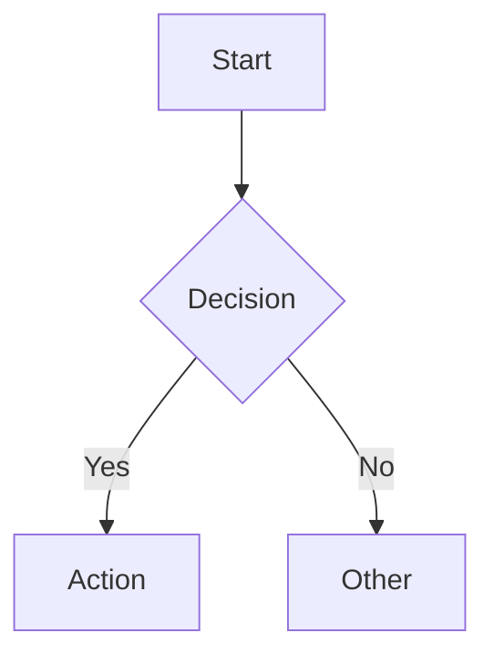

# Document Processing Pipeline - Design Overview

## Executive Summary

This pipeline converts unstructured PDFs into standardized, LLM-friendly formats without any images in the output. Everything is converted to text-based representations: Markdown, YAML, or Mermaid. An LLM judge normalizes the output, HTML is generated for review, and a human-in-the-loop comparison viewer allows corrections.

**Pipeline Flow:**
```
PDF → Extract → Judge → HTML → Review & Correct
```

---

## 1. Architecture Overview

### Four-Step Pipeline

| Step | Tool | Input | Output |
|------|------|-------|--------|
| 1. Extract | `run_pipeline.py` | PDF | entities/, final_document.md, manifest.yaml |
| 2. Judge | `run_judge.py` | output dir | final_document_judge.md |
| 3. Convert | `convert_to_friendly.py` | markdown file | *_friendly.html |
| 4. Review | `compare_viewer.py` | PDF + HTML | corrections.yaml |

### Component Map

```
document_processing/
├── src/
│   ├── pipeline/                    # Step 1: Extraction
│   │   ├── pipeline_config.py       # Configuration and entity types
│   │   ├── document_pipeline.py     # Main orchestrator
│   │   ├── entity_processor.py      # Entity extraction and formatting
│   │   ├── entity_classifier.py     # Vision API classification
│   │   └── document_judge.py        # Step 2: LLM judge
│   ├── converter/
│   │   └── document_converter.py    # Step 3: Markdown → HTML
│   └── corrections/
│       ├── correction_manager.py    # Correction backend and audit trail
│       └── compare_viewer.py        # Step 4: Flask comparison viewer
├── web/
│   ├── templates/compare.html       # Comparison viewer template
│   └── static/                      # CSS and JS assets
├── run_pipeline.py                  # CLI: Step 1
├── run_judge.py                     # CLI: Step 2
├── convert_to_friendly.py           # CLI: Step 3
├── compare_viewer.py                # CLI: Step 4
└── judge_prompt.md                  # System prompt for the LLM judge
```

---

## 2. Step 1: Entity Extraction

### Design Principles

- **Modular**: Each entity saved separately for granular access
- **Standardized**: Only 3 formats (Markdown, YAML, Mermaid)
- **Metadata-Rich**: Every entity includes processing context
- **LLM-Optimized**: Clean, structured, easily parseable
- **Compact**: No redundancy, no image blobs

### Output Structure

```
outputs/<name>/
├── entities/                    # Individual entity files
│   ├── E001_EntityType.TEXT.md
│   ├── E002_EntityType.TABLE.yaml
│   ├── E003_EntityType.DIAGRAM.mmd
│   ├── E004_EntityType.IMAGE_TEXT.md
│   └── E005_EntityType.TABLE.yaml
├── final_document.md           # All entities assembled in order
└── manifest.yaml               # Processing metadata
```

### Entity Types

| Content Type | Output Format | Source |
|-------------|--------------|--------|
| Text / Headings | Markdown (`.md`) | Docling direct |
| Tables | YAML (`.yaml`) | Docling or Vision API fallback |
| Diagrams | Mermaid (`.mmd`) | Vision API |
| Image Text | Markdown (`.md`) | Vision API OCR |
| Forms | YAML (`.yaml`) | Vision API |
| Mixed | Markdown (`.md`) | Vision API |

### Extraction Pipeline Flow

```
┌─────────────────────────────────────────────────────────────┐
│                        INPUT PDF                             │
└─────────────────────────────────────────────────────────────┘
                              ↓
┌─────────────────────────────────────────────────────────────┐
│                    DOCLING EXTRACTION                        │
│  • Text blocks with position/bbox                           │
│  • Native PDF tables (high quality)                         │
│  • Images/pictures                                          │
│  • Page structure preservation                              │
└─────────────────────────────────────────────────────────────┘
                              ↓
┌─────────────────────────────────────────────────────────────┐
│              ENTITY CLASSIFICATION & PROCESSING              │
│                                                             │
│  Text Block  ──→ MARKDOWN (direct)                          │
│  PDF Table   ──→ YAML (validate → fallback to Vision)       │
│  Image       ──→ Vision API classify → extract              │
│                   ├─→ Text? → MARKDOWN                      │
│                   ├─→ Table? → YAML                         │
│                   ├─→ Diagram? → MERMAID                    │
│                   └─→ Mixed? → Best effort                  │
│                                                             │
│  List Detection: Consecutive list items merged into         │
│  single entities (bullets, numbered lists)                  │
└─────────────────────────────────────────────────────────────┘
                              ↓
┌─────────────────────────────────────────────────────────────┐
│                    DOCUMENT ASSEMBLY                         │
│  • Combine entities in original order                       │
│  • Add entity markers (<!-- Entity: E001 | ... -->)         │
│  • Create manifest with metadata                            │
└─────────────────────────────────────────────────────────────┘
```

### Docling Integration

```python
from docling.document_converter import DocumentConverter, PdfFormatOption
from docling.datamodel.base_models import InputFormat
from docling.datamodel.pipeline_options import PdfPipelineOptions

# Docling 2.x API
pipeline_options = PdfPipelineOptions()
converter = DocumentConverter(
    format_options={
        InputFormat.PDF: PdfFormatOption(pipeline_options=pipeline_options)
    }
)

# Iterate items
for item, level in doc.iterate_items():
    if hasattr(item, 'prov') and item.prov:
        page_num = item.prov[0].page_no
```

### Table Extraction with Fallback

Tables use a two-stage approach:
1. **Primary**: Docling native extraction → validate YAML structure
2. **Fallback**: If Docling fails (empty, malformed) → extract table region with PyMuPDF → send to Vision API

This achieves ~100% table capture rate vs ~60% with Docling alone.

### Entity File Formats

**Text Entity** (`E001_EntityType.TEXT.md`):
```markdown
---
entity_id: E001
type: text
source_page: 1
position: 1
confidence: 1.0
processing_notes: "Direct text extraction from Docling"
---

## Emergency Reporting Process

Masters are reminded of their legal obligation to report incidents...
```

**Table Entity** (`E002_EntityType.TABLE.yaml`):
```yaml
# Metadata
# entity_id: E002
# type: table
# confidence: 1.0

fleet_1_vessels:
  - vessel_name: "DIMITRIS C"
    flag: "MAL"
    classification: "DNV"
```

**Diagram Entity** (`E003_EntityType.DIAGRAM.mmd`):


---

## 3. Step 2: LLM Judge

### Purpose

The judge is an LLM post-processor that reads `final_document.md` and produces a normalized version. It addresses limitations of the extraction step where logically related content gets fragmented into separate entities.

### Responsibilities (in priority order)

1. **Group/merge related entities** — split lists, headers, paragraphs
2. **Format content** — consistent headers, list bullets, YAML tables
3. **Correct obvious errors** — OCR artifacts, broken words, duplicates

### Key Design Decisions

- Uses `[ENTITY:EXXX]` placeholder tokens (not HTML comments) when communicating with the LLM to prevent marker stripping
- Preserves all entity tags — merges keep only the first entity's tag
- Never adds or removes information — formatter and grouper only
- Conservative approach — only fixes clear, obvious errors

### Merge Rules

| Pattern | Action |
|---------|--------|
| Repeating page headers | Merge company name, approver, date, title, chapter → 1 entity per page |
| List items | All bullet/numbered items in same list → 1 entity |
| Multi-part headers | Title + subtitle → 1 entity |
| Table fragments | Related table rows → 1 entity |
| Split paragraphs | Text split mid-paragraph → 1 entity |

### Input/Output

- **Input**: `outputs/<name>/final_document.md`
- **Output**: `outputs/<name>/final_document_judge.md`
- **Config**: `judge_prompt.md` (system prompt at project root)
- **Model**: GPT-4o (default) or GPT-4o-mini (cheaper)

---

## 4. Step 3: HTML Conversion

### Purpose

Converts the markdown document (with entity markers) into styled, readable HTML for human review.

### Conversion Rules

| Input Format | HTML Output |
|-------------|-------------|
| Markdown text | Rendered HTML with headings, lists, paragraphs |
| YAML tables | HTML `<table>` elements with proper structure |
| Mermaid diagrams | Rendered via mermaid.js (browser-side) |
| Entity markers | Clickable entity badges with page/type info |

### Mermaid Sanitization

The converter includes mermaid code sanitization for browser-side rendering:
- Removes empty edge labels (`-->| |` → `-->`)
- Quotes node labels with special characters using `["..."]` syntax
- Quotes edge labels with special characters using `|"..."|` syntax
- Separates preamble text from mermaid graph definitions

### Input/Output

- **Input**: `final_document.md` or `final_document_judge.md`
- **Output**: `final_document_friendly.html` or `final_document_judge_friendly.html`

---

## 5. Step 4: Comparison Viewer & Corrections

### Purpose

A Flask-based web app that shows the original PDF and processed HTML side-by-side, with entity-level click-to-edit corrections.

### Features

- Synchronized page navigation between PDF and HTML
- Entity-level click-to-edit (click badge → correction modal)
- Two correction methods: manual editing or AI-assisted
- Document-wide AI corrections (e.g., "fix all date formats")
- Automatic HTML regeneration after every correction
- Full audit trail in `corrections.yaml`

### Correction Flow

```
User clicks entity badge
    ↓
Modal opens with entity content
    ↓
Choose: [Manual Edit] or [AI-Assisted]
    ↓
Manual: Edit textarea        AI: Describe issue → OpenAI generates fix
    ↓                            ↓
Save correction
    ↓
Backend:
  1. Save to corrections.yaml
  2. Update source markdown (judge or regular)
  3. Regenerate HTML
    ↓
Frontend: Reload HTML, highlight corrected entity
```

### Judge Mode vs Regular Mode

When viewing judge HTML:
- Corrections edit `final_document_judge.md` directly (in-place entity content replacement)
- HTML regenerated from `final_document_judge.md`

When viewing regular HTML:
- Corrections edit individual entity files in `entities/`
- `final_document.md` rebuilt from entity files
- HTML regenerated from `final_document.md`

### API Routes

| Method | Route | Description |
|--------|-------|-------------|
| GET | `/api/entity/<id>` | Get entity content for editing |
| POST | `/api/correct-with-ai` | AI-assisted correction |
| POST | `/api/save-correction` | Save and regenerate HTML |
| GET | `/api/corrections` | List all corrections |
| POST | `/api/document-wide-correction` | Analyze document for batch fixes |
| POST | `/api/apply-document-wide-corrections` | Apply batch corrections |

---

## 6. Pitfalls & Mitigations

### Image Quality
- **Problem**: Low-resolution or poorly scanned images lead to bad OCR
- **Mitigation**: Confidence scores tracked in manifest; Docling image preprocessing

### Complex Table Structures
- **Problem**: Merged cells, nested headers
- **Mitigation**: Docling extraction → validation → Vision API fallback

### Diagram Complexity
- **Problem**: 50+ node diagrams may not convert fully to Mermaid
- **Mitigation**: Vision API does best-effort; processing notes indicate complexity

### Entity Fragmentation
- **Problem**: Extraction splits logically related content
- **Mitigation**: LLM judge merges fragments; list detection in extraction step

### API Rate Limits
- **Problem**: Large documents with many images hit OpenAI limits
- **Mitigation**: Retry with exponential backoff; sequential processing

---

## 7. Cost Estimates

| Document Size | Pipeline | Judge | Corrections | Total |
|--------------|----------|-------|-------------|-------|
| Small (< 10 pages) | $0.10 - $0.50 | $0.05 - $0.10 | ~$0.03/each | ~$0.50 |
| Medium (10-50 pages) | $0.50 - $2.00 | $0.10 - $0.30 | ~$0.03/each | ~$2.00 |
| Large (> 50 pages) | $2.00+ | $0.30+ | ~$0.03/each | ~$3.00+ |

Cost optimization:
- Docling handles text and most tables for free
- Vision API only called for images and failed tables
- Judge uses a single API call per document
- AI corrections ~$0.03-0.06 each (GPT-4o)

---

## 8. Dependencies

**Python Packages:**
- `docling>=2.0.0` — PDF extraction
- `openai>=1.12.0` — Vision API, judge, AI corrections
- `flask>=3.0.0` — Comparison viewer web server
- `pyyaml>=6.0` — YAML processing
- `markdown2>=2.4.0` — Markdown to HTML
- `PyMuPDF>=1.23.0` — Table region extraction fallback
- `python-dotenv` — Environment variable loading

**Environment Variables:**
- `OPENAI_API_KEY` — Required for Vision API, judge, and AI corrections

---

## Summary

This pipeline provides a robust solution for converting unstructured PDFs into standardized formats, with LLM-powered normalization and a human-in-the-loop verification system.

**Key Strengths:**
- No images in output — everything text-based
- Intelligent extraction with multi-stage fallbacks
- LLM judge for entity normalization and merge
- User-friendly HTML output
- Side-by-side comparison viewer with correction capabilities
- Full audit trail for all corrections
