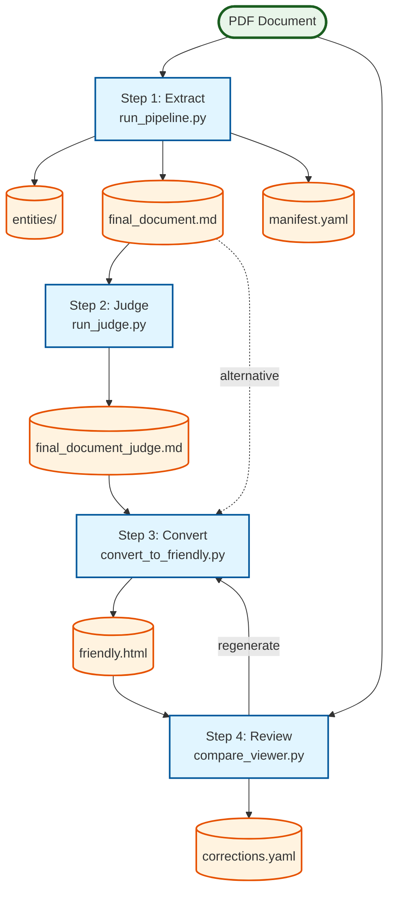
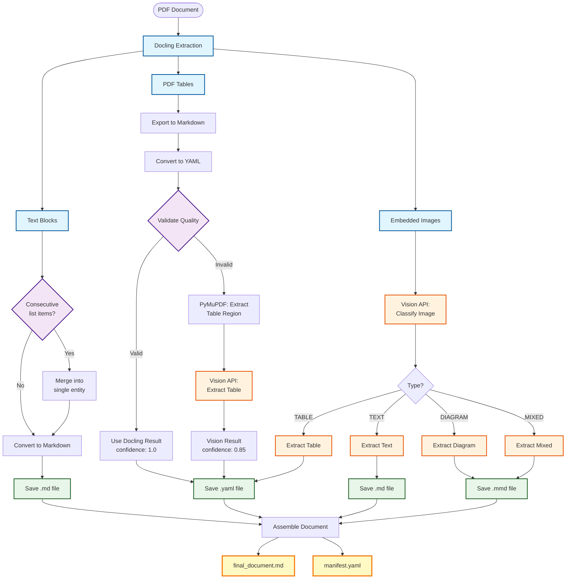
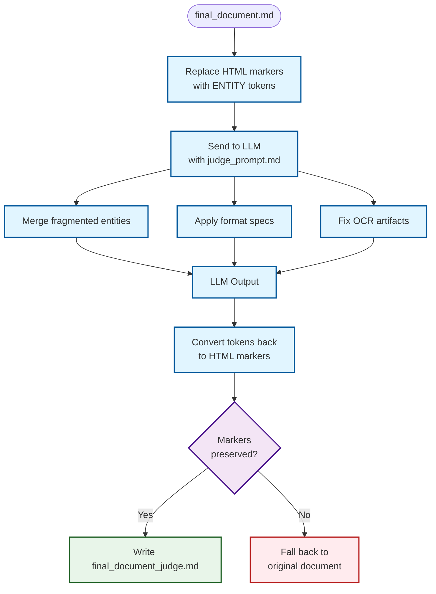
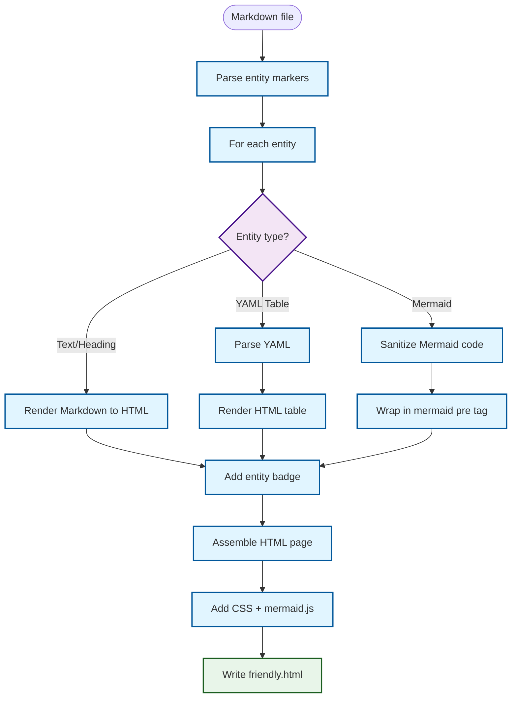
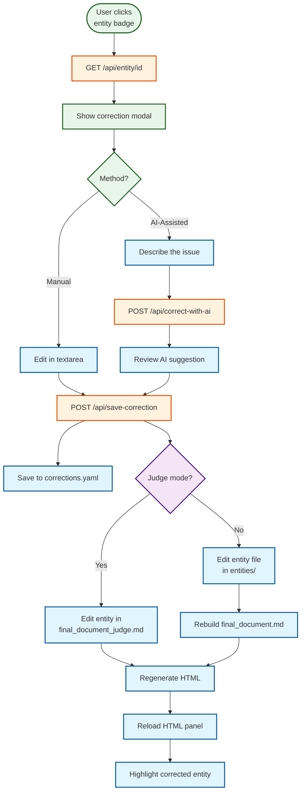

# Document Processing Pipeline - Mermaid Diagrams

## Complete End-to-End Pipeline

## Step 1: Extraction Detail

## Step 2: Judge Flow

## Step 3: HTML Conversion

## Step 4: Correction Flow

## Output File Structure

```mermaid
graph TB
    Root["outputs/name/"] --> Entities["entities/"]
    Root --> FinalDoc["final_document.md"]
    Root --> JudgeDoc["final_document_judge.md"]
    Root --> FriendlyHTML["final_document_friendly.html"]
    Root --> JudgeHTML["final_document_judge_friendly.html"]
    Root --> Manifest["manifest.yaml"]
    Root --> Corrections["corrections.yaml"]

    Entities --> Text["E001_EntityType.TEXT.md"]
    Entities --> Table["E002_EntityType.TABLE.yaml"]
    Entities --> Diagram["E003_EntityType.DIAGRAM.mmd"]
    Entities --> ImgText["E004_EntityType.IMAGE_TEXT.md"]

    FinalDoc -->|Step 1| Note1["All entities assembled<br/>with HTML markers"]
    JudgeDoc -->|Step 2| Note2["Merged and normalized<br/>entities"]
    JudgeHTML -->|Step 3| Note3["Styled HTML with<br/>clickable badges"]
    Corrections -->|Step 4| Note4["Audit trail of<br/>all corrections"]

    classDef dirClass fill:#e3f2fd,stroke:#1565c0,stroke-width:2px
    classDef fileClass fill:#fff3e0,stroke:#e65100,stroke-width:2px
    classDef noteClass fill:#f1f8e9,stroke:#558b2f,stroke-width:1px

    class Root,Entities dirClass
    class Text,Table,Diagram,ImgText,FinalDoc,JudgeDoc,FriendlyHTML,JudgeHTML,Manifest,Corrections fileClass
    class Note1,Note2,Note3,Note4 noteClass
```

