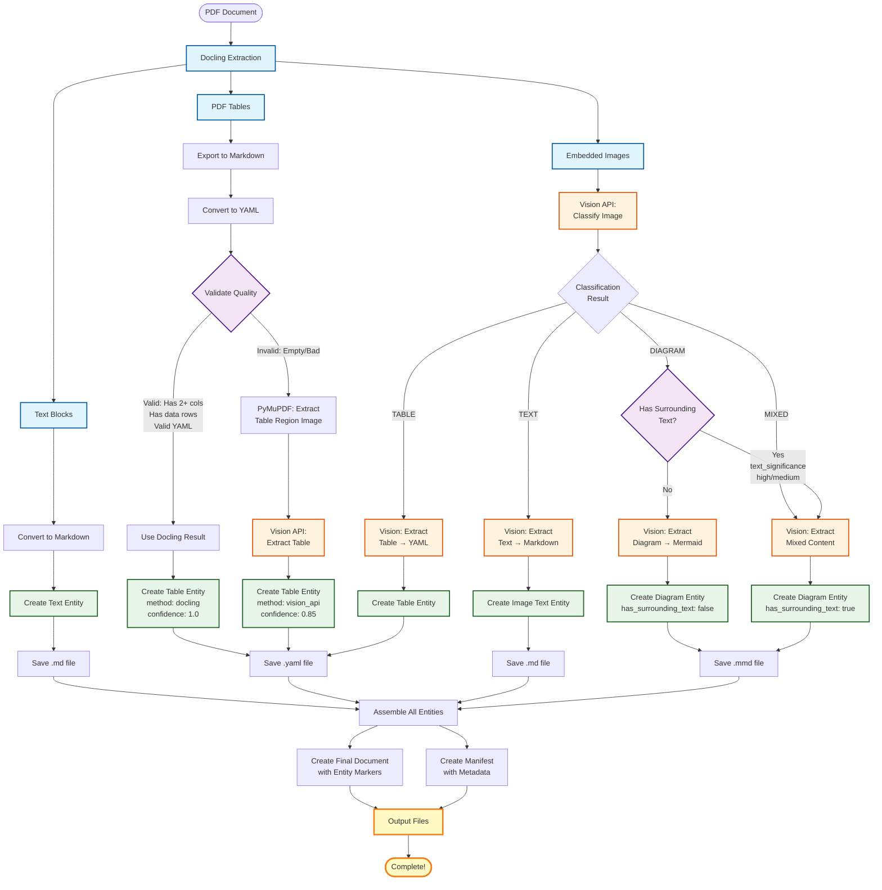
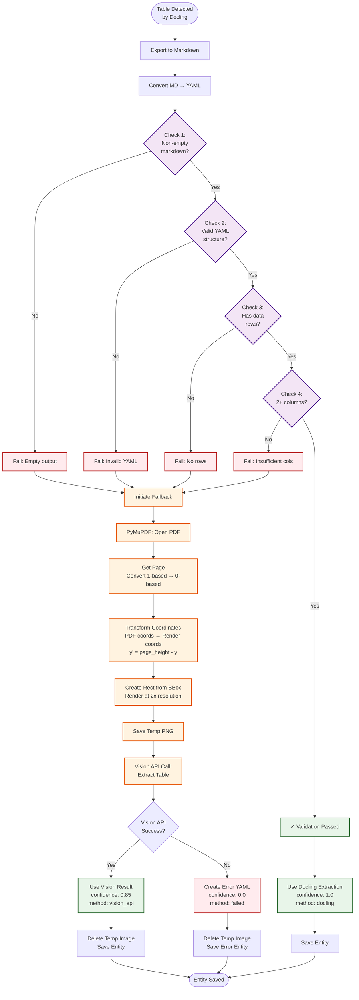
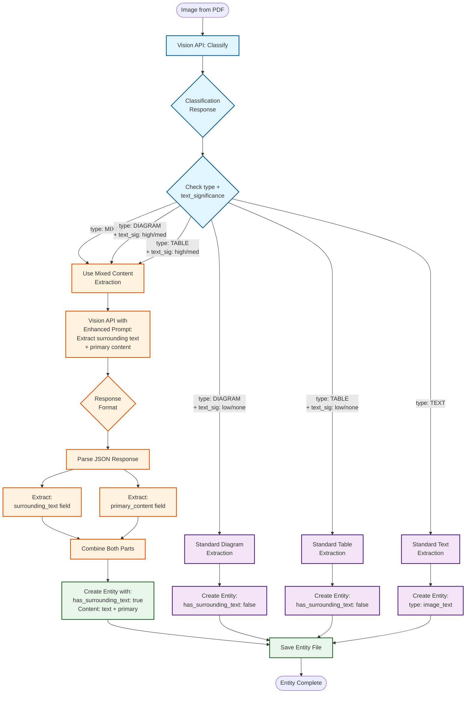
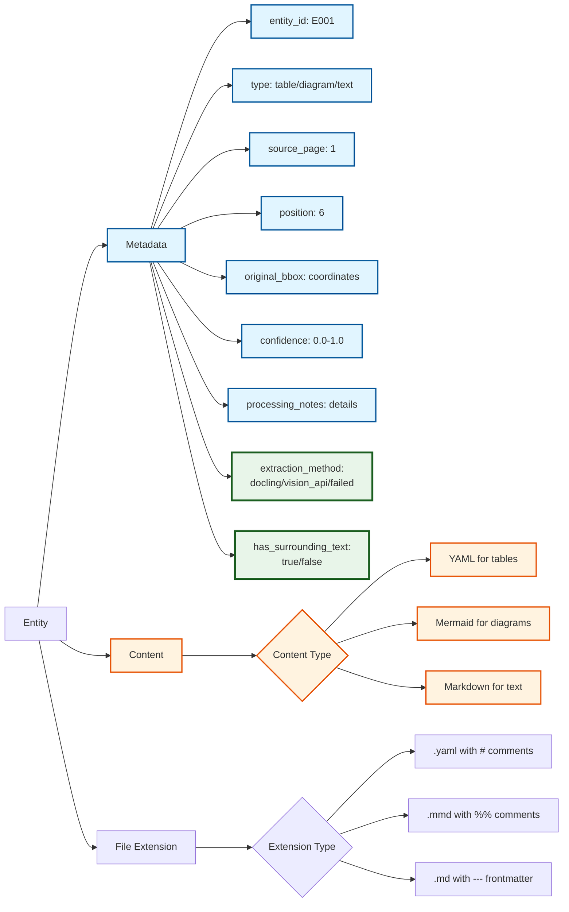
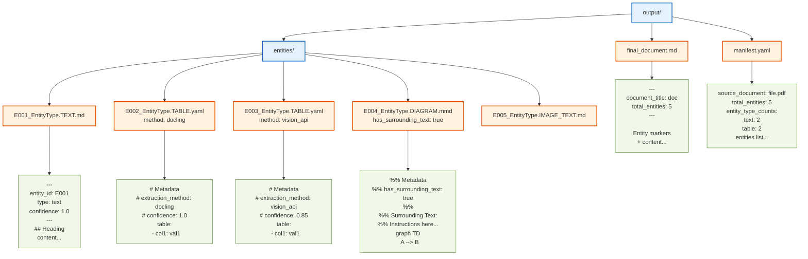

# Document Processing Pipeline - Mermaid Flow Diagram

## Complete System Architecture

## Table Fallback System (Detailed)

## Mixed Content Extraction Flow

## Entity Metadata Structure

## Output File Structure

---

## Key Features Highlighted

### ✓ Smart Table Fallback
- Validates Docling extraction quality
- Automatically falls back to Vision API for failed tables
- Tracks extraction method and confidence in metadata

### ✓ Mixed Content Detection
- Detects text surrounding diagrams/tables
- Extracts both components separately
- Preserves context with structured content

### ✓ Quality Tracking
- Every entity has `extraction_method` field
- Confidence scores reflect extraction quality
- Processing notes explain failures

### ✓ Cost Optimization
- Free Docling extraction used whenever possible
- Vision API only called when needed
- Failed validations trigger fallback, not blind API calls

### ✓ Comprehensive Metadata
- Full provenance tracking (page, bbox, position)
- Extraction method transparency
- Surrounding text indicators
- Quality confidence scores
