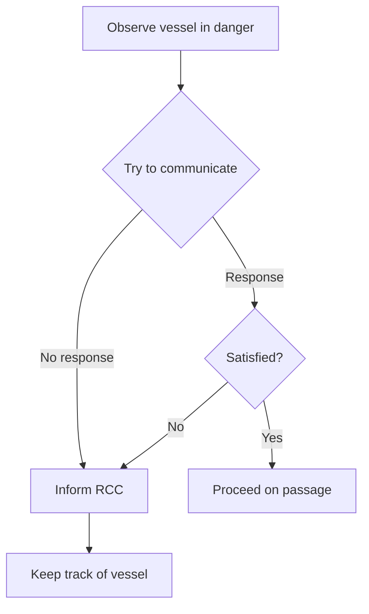
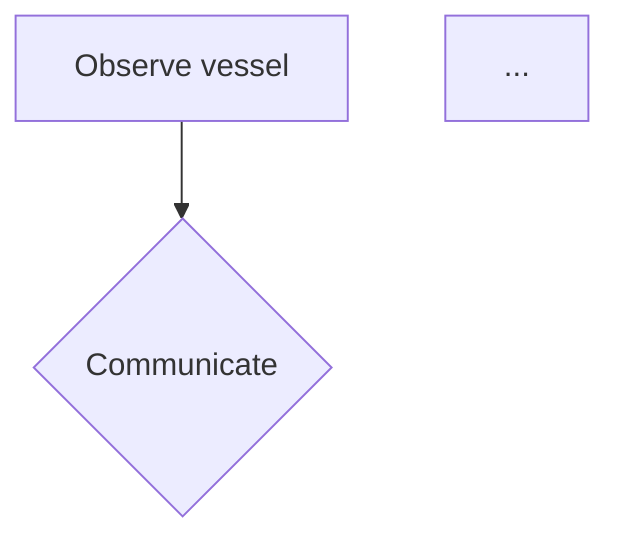

# Direct Answers to Your Questions

## Question 1: Ideal Output Format Schema and Example

### Schema

**Three standardized formats only:**
- **Text** → Markdown (`.md`)
- **Tables** → YAML (`.yaml`)
- **Diagrams** → Mermaid (`.mmd`)

**Two-tier structure:**
```
output/
├── entities/           # Individual files per entity
│   ├── E001_text.md
│   ├── E002_table.yaml
│   └── E003_diagram.mmd
├── final_document.md   # All entities in original order
└── manifest.yaml       # Metadata
```

### Complete Example (Based on Your Emergency Manual)

**Entity: E002_table.yaml**
```yaml
# Metadata
# entity_id: E002
# type: table
# source_page: 2
# confidence: 1.0

vessel_contacts:
  - vessel_name: "DIMITRIS C"
    flag: "MAL"
    classification: "DNV"
    mmsi: "229665000"
    callsign: "9HA3500"
    telephone:
      master: "+870771306882"
      bridge: "+870771306881"
      satellite: "+870773912280"
    email: "vsl_123@danaos.com"
```

**Entity: E003_diagram.mmd**


**final_document.md**
```markdown
---
document_title: "Emergency Procedures Manual"
total_entities: 15
processed_date: "2026-02-05"
---

# Emergency Procedures Manual

<!-- Entity: E001 | Type: text | Page: 1 -->
## Emergency Reporting
Masters must report incidents...

<!-- Entity: E002 | Type: table | Page: 2 -->
```yaml
vessel_contacts:
  - vessel_name: "DIMITRIS C"
    ...
```

<!-- Entity: E003 | Type: diagram | Page: 3 -->

```

**Why this format?**
- ✅ No images (everything text-based)
- ✅ LLM-friendly (easily parseable)
- ✅ Compact (no bloat)
- ✅ Modular (individual entity access)
- ✅ Traceable (metadata for every entity)

---

## Question 2: Integration of Docling + Vision Enrichment

### Architecture

```
PDF Input
    ↓
┌─────────────────────────────────────┐
│  Docling Extraction                 │
│  • Text blocks → Direct to Markdown │
│  • PDF tables → Convert to YAML     │
│  • Images → Send to Vision API      │
└─────────────────────────────────────┘
    ↓
┌─────────────────────────────────────┐
│  Vision API (for images only)       │
│                                     │
│  Step 1: Classify                   │
│    → Text? Table? Diagram?          │
│                                     │
│  Step 2: Extract                    │
│    → Text: OCR to Markdown          │
│    → Table: Structure to YAML       │
│    → Diagram: Convert to Mermaid    │
└─────────────────────────────────────┘
    ↓
┌─────────────────────────────────────┐
│  Entity Files + Final Document      │
└─────────────────────────────────────┘
```

### Integration Code Flow

```python
# 1. Docling extracts everything
doc = docling_converter.convert(pdf_path)

for item in doc.items:
    if isinstance(item, TextItem):
        # Direct conversion - no vision needed
        entity = create_markdown(item.text)

    elif isinstance(item, TableItem):
        # Native PDF table - high quality
        table_md = item.export_to_markdown()
        entity = convert_to_yaml(table_md)

    elif isinstance(item, PictureItem):
        # Image needs vision processing
        image = item.image.pil_image

        # Step 1: Classify
        classification = vision_api.classify(image)
        # Returns: {"type": "table", "confidence": 0.88}

        # Step 2: Extract based on type
        if classification.type == "table":
            entity = vision_api.extract_table_as_yaml(image)
        elif classification.type == "diagram":
            entity = vision_api.extract_diagram_as_mermaid(image)
        elif classification.type == "text":
            entity = vision_api.extract_text_as_markdown(image)
```

### Vision API Usage

**When used:**
- All images from Docling's `PictureItem` elements
- Scanned pages with text
- Images containing tables or diagrams

**How it works:**

1. **Classification Prompt** (JSON response)
```
"Analyze this image and classify: TEXT, TABLE, or DIAGRAM?
Return JSON with type, confidence, and description."
```

2. **Extraction Prompts** (type-specific)

For **tables**:
```
"Extract table as YAML with meaningful keys.
Preserve all data accurately."
```

For **diagrams**:
```
"Convert this diagram to Mermaid syntax.
Preserve all nodes, relationships, and flow."
```

For **text**:
```
"Extract all text as clean Markdown.
Use headings, lists, and structure appropriately."
```

### Key Integration Points

| Component | Input | Output | Purpose |
|-----------|-------|--------|---------|
| Docling | PDF file | Text, Tables, Images | Primary extraction |
| Vision Classifier | Image | Type + confidence | Determine processing |
| Vision Extractor | Image + Type | Markdown/YAML/Mermaid | Convert to standard |
| Entity Processor | All entities | Standardized files | Save with metadata |

---

## Question 3: Pitfalls and Improvements

### Top 5 Pitfalls

#### 1. **Low-Quality Images**
**Problem:** Blurry or low-res images → poor extraction
**Detection:** `confidence < 0.7` in manifest
**Solution:**
```python
# Pipeline auto-upscales images
pipeline_options.images_scale = 2.0
```

#### 2. **Complex Tables**
**Problem:** Merged cells, nested headers → imperfect YAML
**Detection:** Check `processing_notes` in entity metadata
**Solution:** Docling handles most cases; Vision API fallback for image tables

#### 3. **Diagram Complexity**
**Problem:** 50+ nodes → incomplete Mermaid conversion
**Detection:** `confidence < 0.8` for diagram entities
**Solution:** Manual review for critical diagrams; most convert well

#### 4. **API Rate Limits**
**Problem:** Many images → hit OpenAI limits
**Solution:**
```python
# Add retry logic (already included in pipeline)
@retry(stop_after_attempt(3), wait=exponential_backoff)
def call_vision_api(image):
    ...
```

#### 5. **Mixed Content Images**
**Problem:** Image has text + table → must choose extraction method
**Detection:** `type: mixed` in classification
**Solution:** Extract as text (preserves most info); add note in metadata

### Robust Pipeline Features (Already Included)

✅ **Image preprocessing:** Auto-resize and enhance
✅ **Confidence tracking:** Every entity has score
✅ **Error handling:** Retry logic + fallbacks
✅ **Metadata preservation:** Bbox, page, position tracked
✅ **Quality validation:** YAML and Mermaid syntax checks

### Recommended Improvements (Future)

**Improvement 1: Parallel Processing**
```python
# Process multiple images concurrently
from concurrent.futures import ThreadPoolExecutor

with ThreadPoolExecutor(max_workers=5) as executor:
    results = executor.map(process_image, images)
```

**Improvement 2: Caching**
```python
# Cache vision results by image hash
cache_key = sha256(image.tobytes()).hexdigest()
if cache_key in cache:
    return cache[cache_key]
```

**Improvement 3: Review Queue**
```python
# Flag low-confidence entities
review_needed = [
    e for e in entities
    if e.confidence < 0.8
]
# Save to review_queue.yaml
```

**Improvement 4: Progressive Processing**
```python
# Fast pass: Classification only
# Slow pass: Extract only high-value entities (tables, diagrams)
```

### Quality Assurance Checklist

When processing documents, always:

1. ✅ Check `manifest.yaml` for confidence scores
2. ✅ Review entities with confidence < 0.8
3. ✅ Verify critical tables and diagrams manually
4. ✅ Test final document in your LLM system
5. ✅ Monitor API costs (track in manifest)

---

## Quick Start Commands

```bash
# 1. Test installation
python test_pipeline.py

# 2. Process your emergency manual
python run_pipeline.py "All chapters - EMERGENCY PROCEDURES MANUAL_p17-21.pdf"

# 3. Check results
cat output/manifest.yaml
ls output/entities/
cat output/final_document.md
```

---

## Summary

**You asked for:**
1. ✅ Output format: YAML tables, Mermaid diagrams, Markdown text
2. ✅ Integration: Docling extracts → Vision enriches images → Standardized output
3. ✅ Robustness: Confidence tracking, retry logic, validation, metadata

**What you get:**
- Single-document pipeline (not batch)
- No images in output (everything converted)
- Individual entity files + assembled document
- Comprehensive metadata for quality control
- Production-ready error handling

**Next step:**
```bash
python test_pipeline.py  # Verify everything works
```

Then process your documents! 🚀
