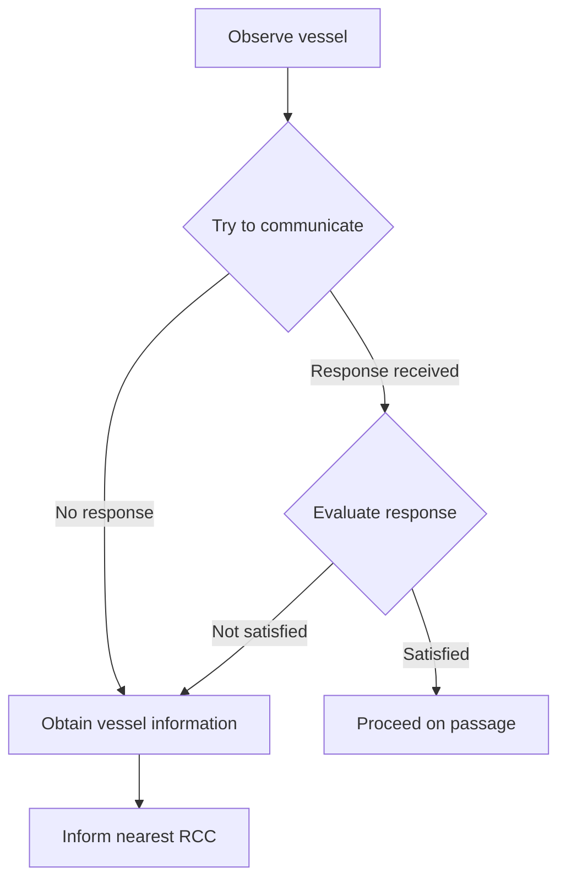
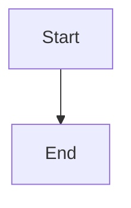

# Document Processing Pipeline - Detailed Guide

## Overview

This pipeline processes PDFs containing mixed content (text, tables, images, diagrams) and produces standardized, text-based output formats suitable for LLM consumption and human review.

**Pipeline Flow:**
```
PDF → Extract → Judge → HTML → Review & Correct
```

### Key Features

- No images in output — everything converted to text-based formats
- Each entity saved as individual file for modular access
- LLM judge normalizes and merges fragmented entities
- User-friendly HTML output for review
- Side-by-side comparison viewer with click-to-edit corrections
- Full audit trail for all corrections

---

## Entity Types

| Type | Description | Output Format | Source |
|------|-------------|---------------|--------|
| `TEXT` | Plain text blocks, headings, paragraphs | Markdown (`.md`) | Docling direct |
| `TABLE` | Structured tables | YAML (`.yaml`) | Docling or Vision API |
| `DIAGRAM` | Flowcharts, process diagrams | Mermaid (`.mmd`) | Vision API |
| `IMAGE_TEXT` | Text extracted from images | Markdown (`.md`) | Vision API OCR |
| `FORM` | Form structures, key-value pairs | YAML (`.yaml`) | Vision API |
| `MIXED` | Multiple content types | Markdown (`.md`) | Vision API |

---

## Output Structure

```
outputs/<name>/
├── entities/                              # Individual entity files
│   ├── E001_EntityType.TEXT.md
│   ├── E002_EntityType.TABLE.yaml
│   ├── E003_EntityType.DIAGRAM.mmd
│   ├── E004_EntityType.IMAGE_TEXT.md
│   └── ...
├── final_document.md                      # All entities assembled in order
├── final_document_judge.md                # Judge-normalized version
├── final_document_friendly.html           # HTML from pipeline output
├── final_document_judge_friendly.html     # HTML from judge output
├── manifest.yaml                          # Processing metadata
└── corrections.yaml                       # Correction audit trail
```

---

## Entity File Formats

### Text Entity (`E001_EntityType.TEXT.md`)

```markdown
---
entity_id: E001
type: text
source_page: 1
position: 1
original_bbox: [72.0, 156.3, 523.2, 789.4]
confidence: 1.0
processing_notes: "Direct text extraction from Docling"
---

## Emergency Reporting Process

Masters are reminded of their legal obligation to report incidents
to Flag, Port and Coast State Authorities, after first advising
the Managers.
```

### Table Entity (`E002_EntityType.TABLE.yaml`)

```yaml
# Metadata
# entity_id: E002
# type: table
# source_page: 2
# confidence: 1.0

fleet_1_vessels:
  - vessel_name: "DIMITRIS C"
    flag: "MAL"
    classification: "DNV"
    mmsi: "229665000"
    contact:
      master_phone: "+870771306882"
      bridge_phone: "+870771306881"
      email: "vsl_123@danaos.com"
```

### Diagram Entity (`E003_EntityType.DIAGRAM.mmd`)



---

## Final Document Format

The assembled `final_document.md` combines all entities with HTML comment markers:

```markdown
---
document_title: "Emergency Procedures Manual"
total_entities: 15
processed_date: "2026-02-05 14:30:00"
source_file: "emergency_manual.pdf"
---

# Document: Emergency Procedures Manual

<!-- Entity: E001 | Type: EntityType.TEXT | Page: 1 -->
## Emergency Reporting
Masters are reminded of their legal obligation...

<!-- Entity: E002 | Type: EntityType.TABLE | Page: 2 -->
```yaml
fleet_1_vessels:
  - vessel_name: "DIMITRIS C"
    flag: "MAL"
```

<!-- Entity: E003 | Type: EntityType.DIAGRAM | Page: 3 -->

```

---

## Manifest Format

```yaml
source_document: "document.pdf"
processed_date: "2026-02-05T14:45:32.123456"
total_entities: 15

entity_type_counts:
  text: 8
  table: 4
  diagram: 2
  image_text: 1

entities:
  - id: E001
    type: text
    page: 1
    position: 1
    confidence: 1.0
    extraction_method: "docling"
    file: "entities/E001_EntityType.TEXT.md"

  - id: E002
    type: table
    page: 2
    position: 2
    confidence: 1.0
    extraction_method: "docling"
    file: "entities/E002_EntityType.TABLE.yaml"

  - id: E003
    type: diagram
    page: 3
    position: 3
    confidence: 0.92
    extraction_method: "vision_api"
    file: "entities/E003_EntityType.DIAGRAM.mmd"
```

---

## Judge Document

The judge output (`final_document_judge.md`) has the same format as `final_document.md` but with entities normalized:

- Fragmented list items merged into single entities
- Split paragraphs rejoined
- Repeating page headers combined (one entity per page)
- Multi-part headers merged
- OCR artifacts corrected

The judge appends a `## Change Log` section at the end documenting all changes made.

---

## Corrections Format

```yaml
corrections:
  E015:
    correction_type: manual
    timestamp: "2026-02-05T14:30:00"
    reason: "Fixed unit conversion error"
    original_content: |
      Viscosity at 50C: Max 10.0 mm2/s
    corrected_content: |
      Viscosity at 50C: Max 10.0 cSt

  E022:
    correction_type: ai
    timestamp: "2026-02-05T14:35:00"
    reason: "LLM correction"
    user_prompt: "The responsible party should be 'Chief Engineer' not 'Master'"
    original_content: |
      actions:
        - description: "Check fuel quality"
          responsible: [Master]
    corrected_content: |
      actions:
        - description: "Check fuel quality"
          responsible: [Chief Engineer]
```

---

## Usage

### Step 1: Extract

```bash
uv run python run_pipeline.py document.pdf
uv run python run_pipeline.py document.pdf --pages 1-10
uv run python run_pipeline.py document.pdf --output mydir/
```

### Step 2: Judge

```bash
uv run python run_judge.py outputs/<name>/
uv run python run_judge.py outputs/<name>/ --model gpt-4o-mini
```

### Step 3: Convert to HTML

```bash
uv run python convert_to_friendly.py outputs/<name>/final_document_judge.md
uv run python convert_to_friendly.py outputs/<name>/final_document.md
```

### Step 4: Review & Correct

```bash
uv run python compare_viewer.py document.pdf outputs/<name>/final_document_judge_friendly.html
uv run python compare_viewer.py document.pdf outputs/<name>/final_document_judge_friendly.html --port 8080
```

---

## Configuration

Edit `src/pipeline/pipeline_config.py`:

```python
VISION_MODEL = "gpt-4o"        # or "gpt-4o-mini" for lower cost
VISION_MAX_TOKENS = 4096        # max tokens for extraction
```

Judge model:
```bash
uv run python run_judge.py outputs/<name>/ --model gpt-4o       # best quality
uv run python run_judge.py outputs/<name>/ --model gpt-4o-mini   # faster, cheaper
```

---

## Extraction Details

### Table Extraction

Tables use a two-stage approach:
1. **Primary**: Docling native extraction → convert to YAML → validate structure
2. **Fallback**: If validation fails → extract table region with PyMuPDF → Vision API

Validation checks:
- Non-empty markdown output
- Valid YAML structure
- At least 1 data row
- At least 2 columns

### Image Classification

For each image in the PDF, the Vision API:
1. Classifies content type (text, table, diagram, mixed)
2. Extracts content in the appropriate format
3. Handles mixed content (e.g., diagram with surrounding text)

### List Grouping

The extraction step detects consecutive list items and merges them:
- Detects bullet markers (-, *, bullet chars)
- Detects numbered lists (1., 2., etc.)
- Groups by indentation and vertical proximity
- Outputs as single markdown list entity

---

## Cost Reference

| Document Size | Pipeline | Judge | Per Correction | Total |
|--------------|----------|-------|----------------|-------|
| Small (< 10 pages) | $0.10 - $0.50 | $0.05 - $0.10 | ~$0.03 | ~$0.50 |
| Medium (10-50 pages) | $0.50 - $2.00 | $0.10 - $0.30 | ~$0.03 | ~$2.00 |
| Large (> 50 pages) | $2.00+ | $0.30+ | ~$0.03 | ~$3.00+ |
