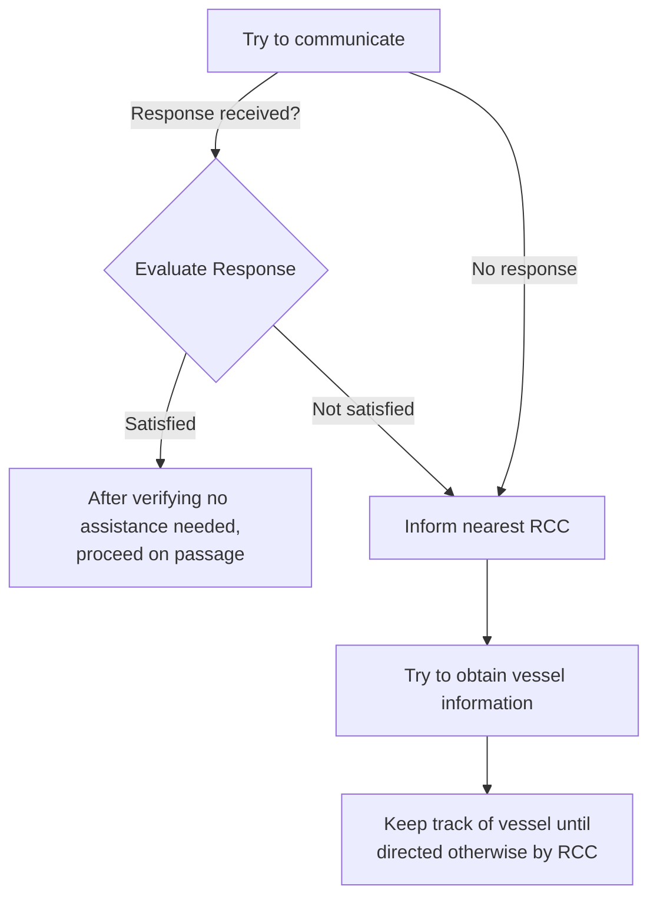
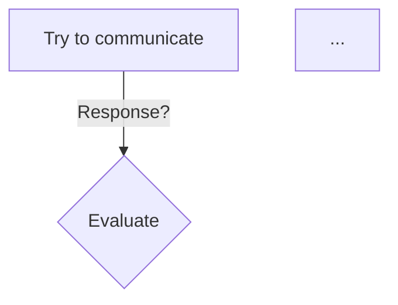

# Document Processing Pipeline

A robust single-document processing pipeline that converts unstructured PDFs into standardized, LLM-friendly formats.

## Overview

This pipeline processes PDFs containing mixed content (text, tables, images, diagrams) and produces:
- **Text** → Markdown
- **Tables** → YAML
- **Diagrams** → Mermaid
- **Images with text** → Extracted text in Markdown
- **Images with tables** → YAML
- **Images with diagrams** → Mermaid

### Key Features

✓ No images in output - everything converted to text-based formats
✓ Each entity saved as individual file for modular access
✓ Final assembled document maintains original order
✓ Comprehensive metadata tracking
✓ Vision AI classification and extraction
✓ High-quality table and diagram conversion

## Output Structure

```
output/
├── entities/
│   ├── E001_text.md          # Text blocks
│   ├── E002_table.yaml        # Tables
│   ├── E003_diagram.mmd       # Diagrams
│   ├── E004_image_text.md     # Text from images
│   └── ...
├── final_document.md          # All entities in order
└── manifest.yaml              # Processing metadata
```

## Entity Format

Each entity file includes YAML frontmatter with metadata:

### Text Entity (`E001_text.md`)
```markdown
---
entity_id: E001
type: text
source_page: 1
position: 1
original_bbox: [x1, y1, x2, y2]
confidence: 1.0
processing_notes: "Direct text extraction from Docling"
---

## Emergency Reporting

The Master must report incidents involving but not limited to Collision,
Grounding, Stranding, Fire, Explosion...
```

### Table Entity (`E002_table.yaml`)
```yaml
# Metadata
# entity_id: E002
# type: table
# source_page: 2
# position: 2

vessel_contacts:
  fleet_1:
    - vessel_name: "DIMITRIS C"
      flag: "MAL"
      class: "DNV"
      mmsi: "229665000"
      telephone:
        - type: "Master"
          number: "+870771306882"
        - type: "Bridge"
          number: "+870771306881"
      email: "vsl_123@danaos.com"
```

### Diagram Entity (`E003_diagram.mmd`)


## Final Document Format

The assembled `final_document.md` combines all entities with markers:

```markdown
---
document_title: "Emergency Procedures Manual"
total_entities: 45
processed_date: "2026-02-05 14:30:00"
source_file: "emergency_manual.pdf"
---

# Document: Emergency Procedures Manual

<!-- Entity: E001 | Type: text | Page: 1 -->
## Emergency Reporting
...

<!-- Entity: E002 | Type: table | Page: 2 -->
```yaml
vessel_contacts:
  fleet_1:
    - vessel_name: "DIMITRIS C"
...
```

<!-- Entity: E003 | Type: diagram | Page: 3 -->

```

## Installation

```bash
# Install dependencies
pip install -r requirements.txt

# Set up OpenAI API key
echo "OPENAI_API_KEY=your-key-here" > .env
```

## Usage

### Basic Usage

```bash
python run_pipeline.py path/to/document.pdf
```

### Specify Output Directory

```bash
python run_pipeline.py document.pdf custom_output/
```

### Programmatic Usage

```python
from document_pipeline import DocumentPipeline

# Initialize pipeline
pipeline = DocumentPipeline(openai_api_key="your-key")

# Process document
final_doc = pipeline.process_document(
    pdf_path="document.pdf",
    output_dir="output"
)

print(f"Processed document saved to: {final_doc}")
```

## Pipeline Architecture

### 1. PDF Extraction (Docling)
- Extracts text, tables, and images
- Maintains positional information
- OCR for scanned content
- High-quality table structure recognition

### 2. Entity Classification (OpenAI Vision API)
For each image/picture element:
- Classifies content type (text, table, diagram)
- Determines extraction strategy
- Provides confidence scores

### 3. Content Conversion
- **Text**: Clean markdown formatting
- **Tables**: Structured YAML with meaningful keys
- **Diagrams**: Mermaid flowchart syntax
- **Mixed**: Best-effort extraction with notes

### 4. Output Generation
- Individual entity files with metadata
- Final assembled document
- Processing manifest

## Configuration

Edit `pipeline_config.py` to customize:

```python
class PipelineConfig:
    # Vision model
    VISION_MODEL = "gpt-4o"
    VISION_MAX_TOKENS = 4096

    # Output paths
    OUTPUT_DIR = "output"
    ENTITIES_DIR = "output/entities"

    # Docling options
    DOCLING_OPTIONS = {
        "do_table_structure": True,
        "do_ocr": True,
        ...
    }
```

## Entity Types

| Type | Description | Output Format | Source |
|------|-------------|---------------|--------|
| `text` | Plain text blocks | Markdown | Docling direct |
| `table` | Structured tables | YAML | Docling or Vision |
| `diagram` | Flowcharts, diagrams | Mermaid | Vision API |
| `image_text` | Text from images | Markdown | Vision API OCR |
| `form` | Form structures | YAML | Vision API |
| `mixed` | Multiple content types | Markdown | Vision API |

## Troubleshooting

### "OpenAI API key required"
- Ensure `.env` file exists with `OPENAI_API_KEY=...`
- Or set environment variable: `export OPENAI_API_KEY=your-key`

### Poor table extraction
- Tables from images use Vision API - quality depends on image clarity
- Native PDF tables (extracted by Docling) are more accurate
- Check `manifest.yaml` for confidence scores

### Diagram conversion issues
- Complex diagrams may not convert perfectly to Mermaid
- Check entity file for conversion notes
- Manual review recommended for critical diagrams

### Large documents
- Pipeline processes entities sequentially
- Vision API calls may take time for image-heavy docs
- Monitor progress via console output

## Best Practices

1. **Image Quality**: Higher resolution images → better extraction
2. **Table Structure**: Clean, grid-based tables work best
3. **Diagram Clarity**: Simple, well-labeled diagrams convert better
4. **Review Output**: Always review `manifest.yaml` for confidence scores
5. **Iterative Refinement**: Use entity files to identify issues

## API Costs

Approximate OpenAI API costs per document:
- Small doc (< 10 images): $0.10 - $0.50
- Medium doc (10-50 images): $0.50 - $2.00
- Large doc (> 50 images): $2.00+

Using `gpt-4o` model (optimal quality/cost balance).

## Limitations

- Does not preserve exact visual layout
- Complex multi-column layouts may lose structure
- Handwritten text recognition limited
- Very complex diagrams may not convert fully
- Non-English text extraction varies by language

## Future Enhancements

Potential improvements:
- [ ] Batch processing support
- [ ] Custom classification models
- [ ] Layout preservation options
- [ ] Interactive review UI
- [ ] Parallel processing for speed
- [ ] Custom entity type plugins

## Examples

See `output/` directory after processing the sample emergency manual for complete examples.

## Support

For issues or questions:
1. Check `manifest.yaml` for processing details
2. Review entity files for conversion quality
3. Examine console output for errors
4. Check API key and permissions
