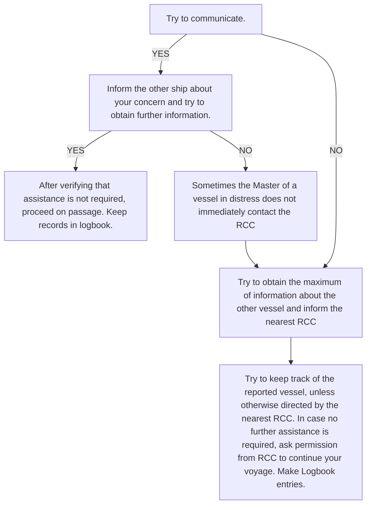

# Document: All Chapters - Emergency Procedures Manual P51

<!-- Entity: E001 | Type: EntityType.IMAGE_TEXT | Page: 1 -->

## danaos

### Safety Management System

<!-- Entity: E002 | Type: EntityType.TEXT | Page: 1 -->

Approver: MANAGEMENT

<!-- Entity: E003 | Type: EntityType.TEXT | Page: 1 -->

Effective Since: 01- 04- 2003

<!-- Entity: E004 | Type: EntityType.TEXT | Page: 1 -->

## Emergency Procedures Manual

<!-- Entity: E005 | Type: EntityType.TEXT | Page: 1 -->

## Chapter :                  10

<!-- Entity: E006 | Type: EntityType.TEXT | Page: 1 -->

## Emergency Response Checklists

<!-- Entity: E007 | Type: EntityType.DIAGRAM | Page: 1 -->

